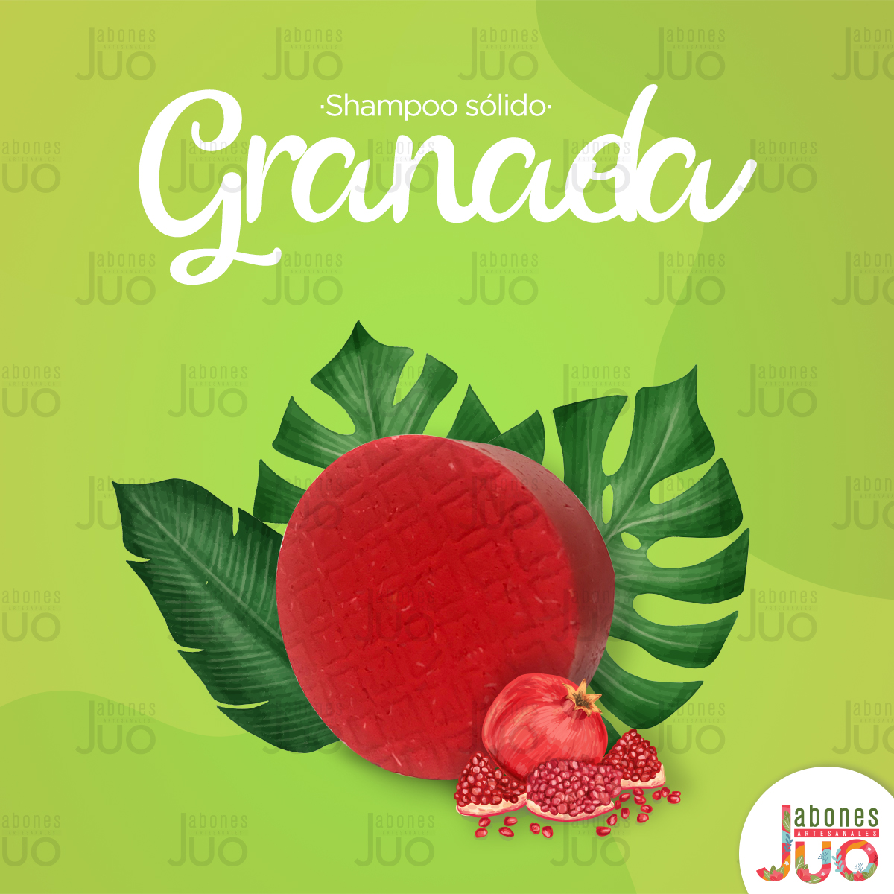

<head>

  <meta charset="utf-8">
  <meta name="viewport" content="width=device-width, initial-scale=1, shrink-to-fit=no">
  <meta name="description" content="">
  <meta name="author" content="">

  <title>Jabones_Juo</title>
  <link rel="stylesheet" href="https://stackpath.bootstrapcdn.com/bootstrap/4.5.2/css/bootstrap.min.css" integrity="sha384-JcKb8q3iqJ61gNV9KGb8thSsNjpSL0n8PARn9HuZOnIxN0hoP+VmmDGMN5t9UJ0Z" crossorigin="anonymous">
  <link href="styles.css" rel="stylesheet">

</head>
<body>
  
  <nav class=""><nav class="navbar navbar-light" style="background-color: rgb(0, 195, 255);">
  <nav class="navbar navbar-expand-lg navbar-light bg-">
    <a class="navbar-brand" href="./Index (1).html">Jabones Juo</a>
    <button class="navbar-toggler" type="button" data-toggle="collapse" data-target="#navbarSupportedContent" aria-controls="navbarSupportedContent" aria-expanded="false" aria-label="Toggle navigation">
      
    </button>
    

      <ul class="navbar-nav mr-auto">
        <li class="nav-item active">
          <a class="nav-link" href="./Index (1).html"> Inicio </a>
        </li>
        <li class="nav-item active">
          <a class="nav-link" href="/src/Shampoo.html"> Shampoo (current)</a>
        <link rel="stylesheet" href="main.js">
        

      </li>
      <li class="nav-item active">
        <a class="nav-link" href="./src/jabones.html"> Jabones(current)</a>
      <link rel="stylesheet" href="main.js">
      

        <li class="nav-item active">
          <a class="nav-link" href="./src/acondicionador.html"> Acondicionadores (current)</a>
        <link rel="stylesheet" href="main.js">
        

          
      </li>
    </li>
      
        </ul>
        

          

            

              <input type="text" placeholder="Busqueda" required>
            

          

        

      </nav>
  
      

    

  </nav>
  </nav>
  

    <ol class="breadcrumb">

    

      

        
      

      

        <h2>Acerca de nosotros.</h2>
        
Somos una Empresa dedicada a la fabricación y venta de Jabones Artesanales a base de aceites vegetales y aceites esenciales de glicerina vegetal, con aditivos naturales que nos conectan con la madre naturaleza y brindan bienestar a nuestro cuerpo. En Jabones Juo elaboramos Jabones ya sean de aceites, de parafina, ecológicas, de colores, flotantes y decorativas los cuales son versátiles para cualquier tipo de ocasión.
          Nuestros productos son netamente ecológicos y biodegradables generando conciencia para la protección del Medio Ambiente y el equilibrio ecológico así como el cuidado de la piel.

        
En Jabones Juo  nos enfocamos principalmente en satisfacer las necesidades y gustos de nuestros Clientes, nuestro objetivo está garantizado gracias a nuestra experiencia, conocimiento, materia prima de calidad y al entusiasmo que día a día aportamos para elaboración de nuestros productos. En el futuro queremos emprender el rumbo hacia la cosmética artesanal abarcando nuevos mercados y conquistando a los clientes potenciales.

      

    

    <h2>Productos</h2>
    

      

        
        

          <h5 class="card-title">Jabones</h5>
          
Nuestros jabones estan echos a base de aceites naturales y los mejores productos nacionales para darte una deliciosa espuma y limpieza sin descuidar la proteccion de tu piel.
            Ingredientes:
          

          

            <a href="jabones.html" class="btn btn-primary">Ver catalogo</a>
          

        

      

      

        
        

          <h5 class="card-title">Acondicionador</h5>
          
Mezcla exclusiva de ingredientes botánicos únicos con las últimas tecnologías, creando fórmulas de alto rendimiento para realzar la belleza de todo tipo de cabello.

          

            <a href="Acondicionador.html" class="btn btn-primary">Ver catalogo</a>
          

        

      

      

        
        

          <h5 class="card-title">Shampoo</h5>
          
¡Una práctica forma de cuidar de tu cabello! Shampoos sólidos, sin embalaje y libres de conservantes.

          

            <a href="Shampoo.html" class="btn btn-primary">Ver catalogo</a>
          

        

        
      

    

  

  <HTML>
    <HEAD>
    
 

  <footer class="py-5" style="background-color: rgb(0, 195, 255);">
    

      
Copyright &copy; Derechos reservados por Jabones Juo

    

  </footer>

  
  
  
  
</body>

</html>
